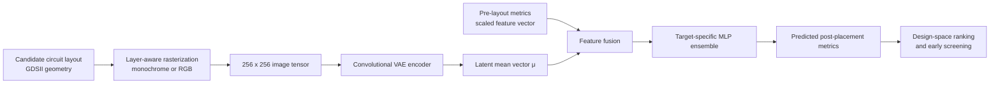
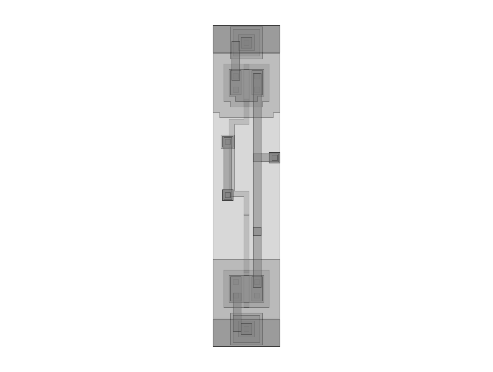

# Analog Layout Performance Prediction

## Learning post-placement circuit behavior from layout representations

Analog-circuit design repeatedly evaluates expensive physical-design and
simulation steps. This research studies whether a layout representation can be
combined with inexpensive pre-layout measurements to predict post-placement
performance before the full evaluation flow completes.

The work combines GDSII-derived layout images, a convolutional variational
autoencoder (VAE), and target-specific regressors. The public repository is a
research portal: it documents the problem, data representation, model family,
evaluation protocol, and publications without releasing the implementation or
proprietary datasets.

> **Release status:** documentation, sanitized examples, and the latest
> reported benchmark summary are available now.

## Problem statement

Let `x_layout` represent the physical layout image and `y_pre` represent
inexpensive pre-layout performance measurements. The goal is to estimate
post-placement targets `y_post`:

```text
f(x_layout, y_pre) → y_post
```

The predicted targets include circuit-level quantities such as current,
small-signal gain, bandwidth, phase margin, and offset, depending on the
dataset and experiment. The intended use is design-space exploration: rank or
filter candidate layouts before committing to the most expensive downstream
analysis.

## Research contribution

- A layout-to-image representation for multi-layer analog-circuit geometry.
- A convolutional VAE that compresses a 256×256 layout image into a compact
  latent representation.
- Regressors that fuse the layout latent with pre-layout performance features.
- Comparisons across grayscale/RGB representations, latent sizes, scaling
  methods, direct prediction, residual prediction, fine-tuning, ensembles, and
  transfer-learning variants.
- A reproducible documentation record for the datasets, model family, and
  evaluation methodology.

## Architecture



The VAE decoder is used for representation learning and reconstruction
analysis. Regression experiments generally use the encoder mean `μ` as a
deterministic layout feature.

## Technology stack

| Area | Technology |
| --- | --- |
| Language | Python |
| Deep learning | PyTorch, torchvision |
| Image processing | gdspy, Pillow, Matplotlib |
| Data processing | pandas, NumPy |
| Hyperparameter search | Optuna with SQLite studies |
| Classical baseline | scikit-learn Random Forest regressors |
| Data versioning plan | DVC for private datasets and large artifacts |
| Documentation | Markdown and Mermaid diagrams |

## Dataset description

The experiments use two related analog-circuit layout collections. Each sample
joins a layout identifier with pre-placement and post-placement performance
measurements. The raw GDSII files, simulation outputs, generated image sets,
and complete CSV tables are not included in this public repository.

| Collection | Generated/source records | Usable paired records | Typical targets |
| --- | ---: | ---: | --- |
| Layout collection 1 | 10,192 | 4,055 | GBW, gain, current, offset, phase margin |
| Layout collection 2 | 5,469 | 5,468 | GBW, gain, current, phase margin |

Counts reflect the filtering rules used by the experiments, including finite
metric checks and collection-specific validity constraints. They should not be
interpreted as a license to redistribute the underlying data.

More detail is available in [`docs/dataset.md`](docs/dataset.md).

## Example input and output

The example layout image is a sanitized geometry rendering. The accompanying
numbers are illustrative and are not benchmark claims.



| Input | Example value |
| --- | ---: |
| Layout representation | 256×256 RGB tensor |
| Pre-layout bandwidth | 9.8 MHz |
| Pre-layout gain | 27.4 dB |
| Pre-layout current | 0.17 µA |
| Pre-layout phase margin | 50.1° |

| Output | Example value |
| --- | ---: |
| Predicted post-placement bandwidth | 0.46 MHz |
| Predicted post-placement gain | 29.7 dB |
| Predicted post-placement current | 0.13 µA |
| Predicted post-placement phase margin | 19.5° |

The input/output contract and units are documented in
[`docs/examples.md`](docs/examples.md).

## Performance results

The latest reported results are summarized below. Values and emphasis are
reproduced from the supplied results table; detailed split and protocol
metadata should be added alongside any future benchmark expansion.

| Model | Metric | `I_dd` [µA] | `G_dc` [dB] | GBW [Hz] | PM [°] |
| --- | --- | ---: | ---: | ---: | ---: |
| Layer-aware approach | MAE | 1.28 | **0.022** | 926 × 10³ | 0.251 |
| Layer-aware approach | MAPE [%] | 1.32 | **0.05** | 1.05 | 0.38 |
| Layer-aware approach + pre-layout fusion | MAE | **0.022** | **0.022** | **121 × 10³** | **0.132** |
| Layer-aware approach + pre-layout fusion | MAPE [%] | **0.02** | **0.05** | **0.09** | **0.21** |

See [`docs/results.md`](docs/results.md) for the table and reporting guidance.

## Publications

This work has led to the following publications and research outputs:

- **Leveraging Convolutional Autoencoders for Post-Layout Performance Estimation of Analog ICs** — ICECS 2025
- **On the Exploration of Convolutional Variational Autoencoders for Analog Integrated Circuit Post-Placement Performance Regression** — SMACD25
- **Combining Layer-Aware Images and Pre-Layout Fusion for Accurate Analog IC Post-Layout Performance Prediction** — SMACD26
- **Generative AI for Next Generation Computer Design** — book chapter, Springer Nature

Author publication record: [Google Scholar profile](https://scholar.google.com/citations?user=6ql7fJIAAAAJ&hl=pt-PT)

See [`docs/publications.md`](docs/publications.md) for the publication record.

## Scope and responsible release

This repository does not contain training code, inference code, model weights,
raw layout files, proprietary algorithms, private infrastructure, or complete
datasets. The companion private repository contains the implementation and
internal experiment inventory.

## License

The documentation and approved public assets are released under the MIT
License. See [`LICENSE`](LICENSE).

## Citation and contact

Citation metadata, author list, institutional affiliations, project URL, and
contact information will be completed before the public release is announced.
