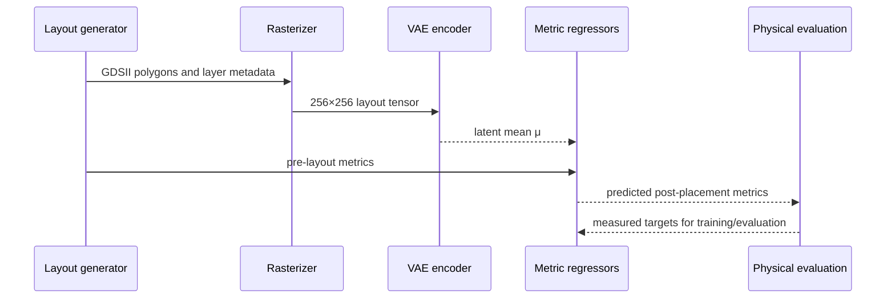

# Architecture

## End-to-end flow

The research workflow has five conceptual stages:

1. **Layout representation:** read GDSII polygon geometry and group polygons by
   layer/datatype.
2. **Rasterization:** render the geometry into fixed-size monochrome or RGB
   images. Selected layers can be assigned distinct colors while other layers
   remain neutral.
3. **Latent representation:** encode the image with a convolutional VAE. The
   encoder produces a mean vector `μ` and log-variance vector `log σ²`.
4. **Feature fusion:** concatenate the deterministic image representation `μ`
   with scaled pre-layout measurements.
5. **Prediction:** use separate regression heads or an ensemble to estimate
   post-placement performance targets.

## Representation choices

The experiments compare monochrome and RGB representations. RGB preserves a
small amount of layer identity; it is not intended to reproduce a complete
technology-rule visualization. Alpha compositing is used to make overlapping
layers visible after resizing.

## Regression choices

The regressors include direct post-placement prediction and residual prediction
of `post − pre`. Target-specific scaling is fitted on the training split and
inverted before reporting metrics in natural units. Some variants freeze the
VAE encoder while others fine-tune it jointly with the regressors.
