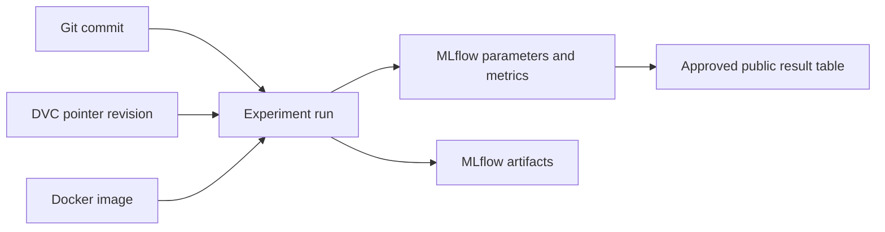

# Reproducibility toolchain

This portal documents the public-facing reproducibility contract for the
analog-layout performance research. The implementation and private datasets
remain in the private repository.

## Tools

| Tool | Role | Public-repository boundary |
| --- | --- | --- |
| Git | Version source, documentation, and configuration | This repository contains documentation and approved assets only |
| DVC | Version dataset and large-artifact pointers | The public repository does not contain private DVC payloads |
| MLflow | Track experiments, parameters, metrics, tags, and artifacts | Public run summaries may be published after approval |
| Docker | Pin the reproducibility tool environment | The included image contains no private source or datasets |

## Reproducibility flow



Each published result should identify the Git commit, DVC pointer revision,
container version or digest, MLflow run ID, dataset identity, split policy, and
metric definitions. These identifiers make it possible to distinguish a
reproduced result from a merely similar rerun.

## Local tool environment

The repository includes a minimal Docker environment for the reproducibility
tools and a local MLflow tracking server:

```bash
docker compose up -d mlflow
docker compose run --rm reproducibility-tools dvc --version
docker compose run --rm reproducibility-tools mlflow --version
```

The local MLflow UI is available at `http://localhost:5000`. It is intended
for local inspection only; do not expose it publicly without authentication
and an approved backend/artifact-storage policy.

## Scope

The public table in [`results.md`](results.md) is a curated summary. The
private repository is the source of truth for the training code, DVC data
pointers, MLflow run metadata, and restricted artifacts.
